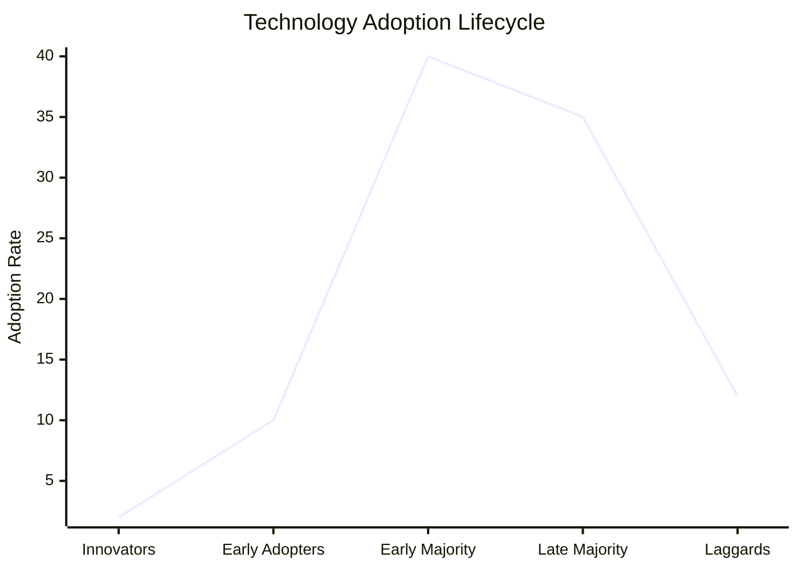

Supports [[AI is ready to Cross The Chasm And Out Of The Trough]]
See [[Diffusion of Innovation]]
#### Overview of Curve:  
Note This Does Not Show Chasm that is in the middle of the earlier adopters.  Markets often stall at around 10% of the market, but if you get into the Early Majority, the momentum generally continues.

See also [[Technology-S Curves]]

#### Summary

"Crossing the Chasm" is a marketing concept introduced by Geoffrey A. Moore that focuses on the challenges technology companies face when transitioning from early adopters to the mainstream market. The key points of this concept are:

## Technology Adoption Life Cycle

The book describes five stages of technology adoption:

1. Innovators: Technology enthusiasts who adopt new products first
2. Early Adopters: Visionaries who see strategic potential in new technology
3. Early Majority: Pragmatists who want proven solutions
4. Late Majority: Conservatives who adopt only when necessary
5. Laggards: Skeptics who resist new technology

## The Chasm

The "chasm" refers to the gap between Early Adopters and the Early Majority. This represents a critical transition point where many high-tech products fail.

## Crossing Strategies

To successfully cross the chasm, Moore recommends:

1. Focusing on a specific niche market
2. Creating a compelling use case
3. Developing a "whole product" solution
4. Building word-of-mouth marketing

## Key Challenges

- Different buying motivations between visionaries and pragmatists
- Need for a shift from product-based to market-based values
- Importance of strategic positioning against competitors

The book emphasizes that crossing the chasm requires a unified company approach, involving not just marketing but all aspects of the business. It provides a model for successfully marketing high-tech products and addressing the gap in existing strategies for moving from early adoption to mainstream market success.

Citations:
[1] https://www.productthinking.cc/p/crossing-the-chasm
[2] https://youexec.com/book-summaries/marketing-selling-high-tech-products
[3] https://fourminutebooks.com/crossing-the-chasm-summary/
[4] https://www.joecotellese.com/posts/crossing-the-chasm-book-summary/
[5] https://www.linkedin.com/pulse/crossing-chasm-summary-how-take-action-david-fallarme
[6] https://en.wikipedia.org/wiki/Crossing_the_chasm
[7] https://howdo.com/book-summaries/crossing-the-chasm-summary-and-review/
[8] https://www.hightechstrategies.com/crossing-the-chasm-summary/