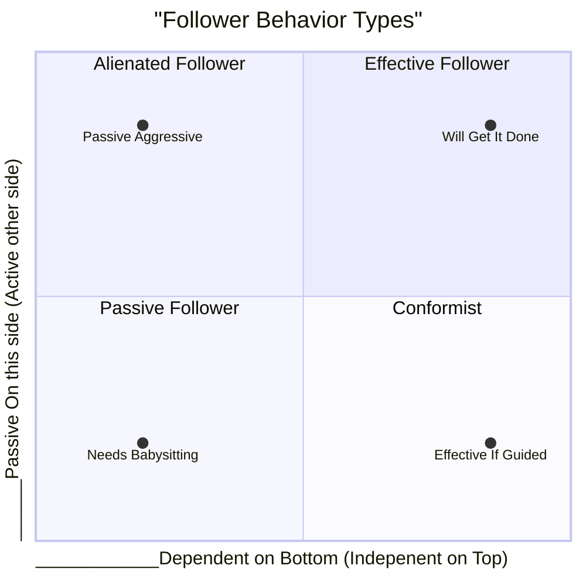

Followership was coined and used in [[Being A Star At Work]], which was recognized at one time as being very powerful, and on the best business books.  At the time, many business books were captivated by Leadership, and Kelley pointed out that Leaders needed effective followers.
## Followership

There is good and bad following.  He uses this model.

**The Right Side Of Chart Is Passive 
The Left is Active
The Top Is An Independent Thinker
The Bottom Is A Dependent Thinker

The **Passive Aggressive** person doesn't look like they are going to fight you, which you may take as a positive.  But what you don't realize is that they actually think you are full of shit, and won't tell you.  Therefore, we call these people a snake in the grass.  Yes to your face, and bomb you when you are not around.

*Prescription: Kill at all costs.*

The **Needs Babysitting** is the person that shows up at work and just needs a job.  They'll do what you tell them to do, but they lack the inner drive to succeed.  These are your lower performers because they twist in the wind.  With AI, we may be able to both spot them and AI may be able to redeem them through being the follow-up item.

*Prescription:  Use AI to rescue if possible

The **Effective If Guided** really embraces you vision.  In some sense, they may appeal to your personality because they show a tremendous amount of activity and support of your cause.  The problem is that they cannot pivot.  If effective, they will bring the problem to you to make sure they are doing the right thing, but this is problematic if the environment is changing as they come to you for guidance.

*Prescription:  Use AI to help guide if possible or deploy in environments of stability

The **Will Get It Done** may look like a problem at first as they may want to argue.  The argument is an important part of their bearing process.  This follower argues strongly upfront to make sure that they have a a clear [[Commanders Intent]] to pursue your goal. 

*Prescription:  You never have enough of these followers, make them core to your plans, and use AI tools to help shape and create more of them