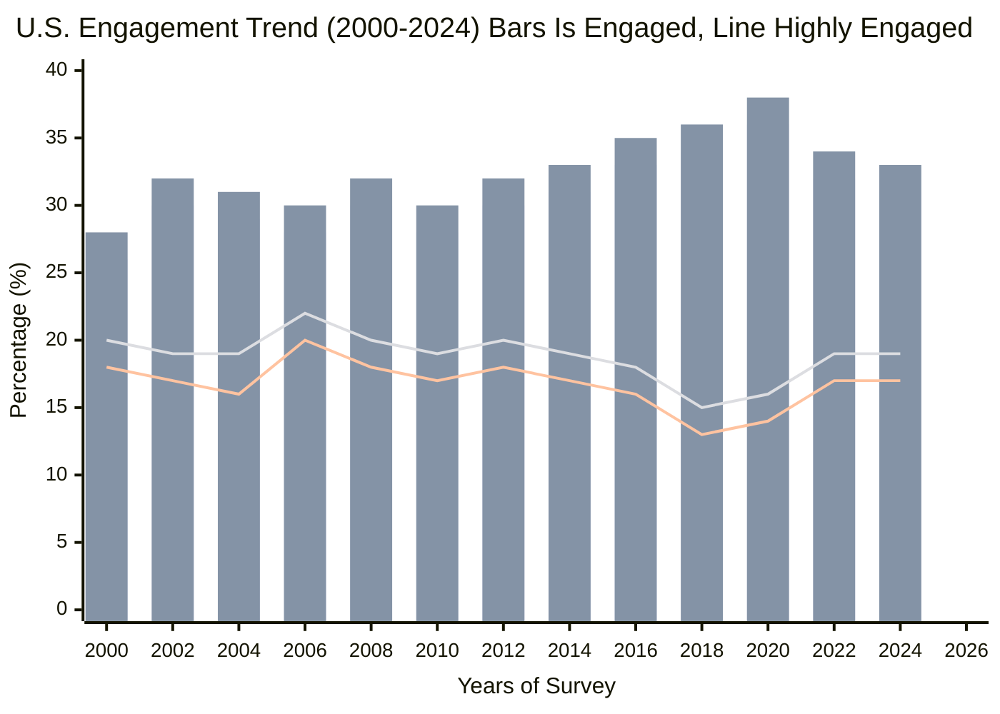
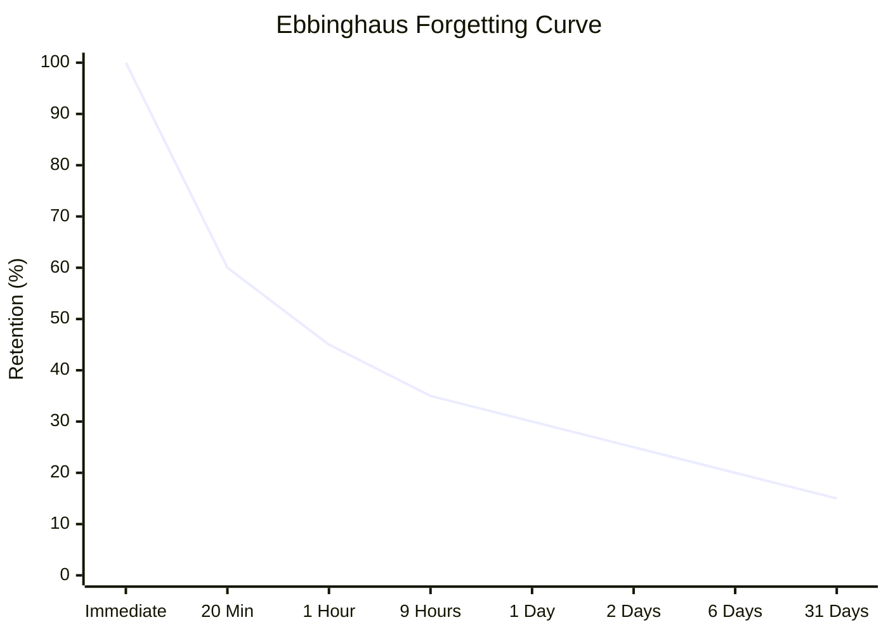
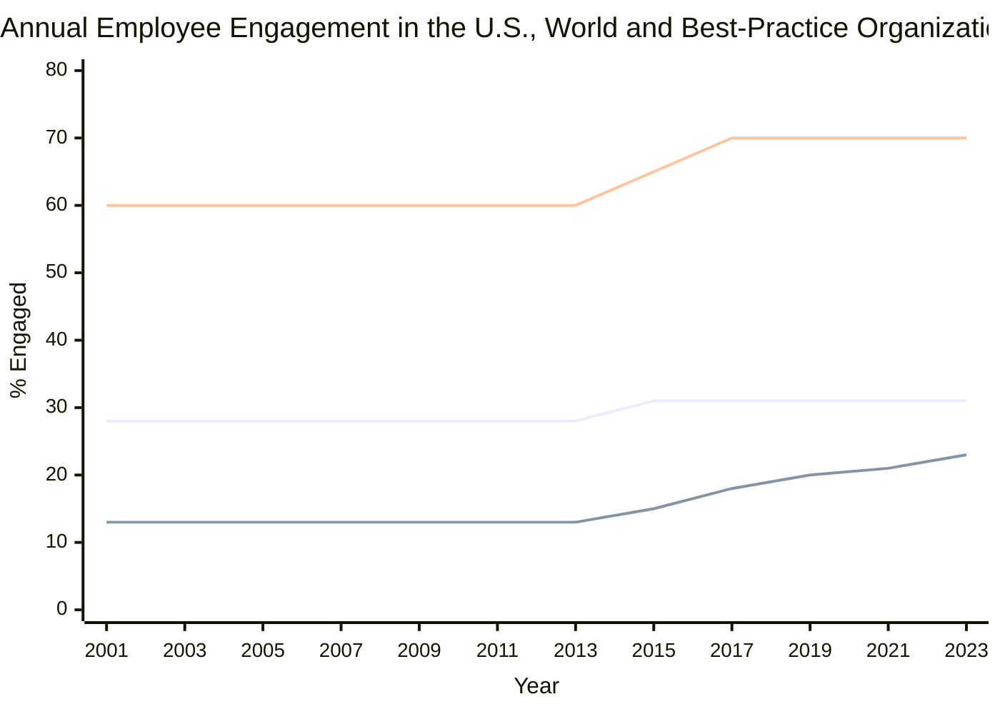
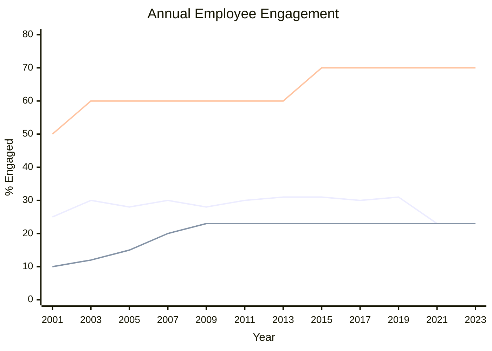
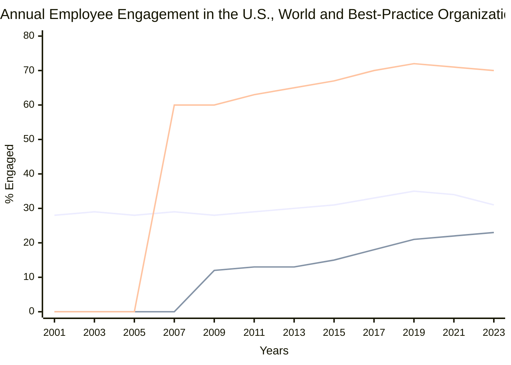
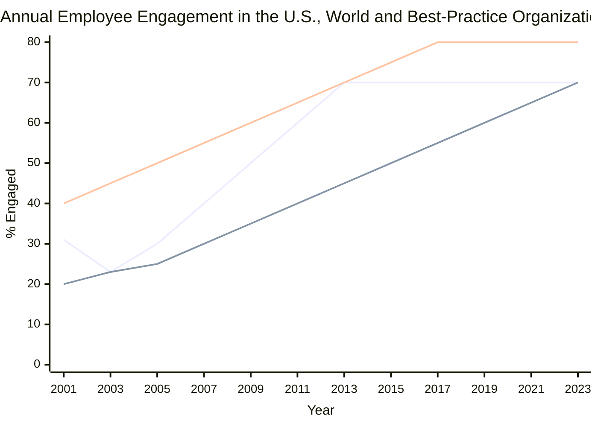
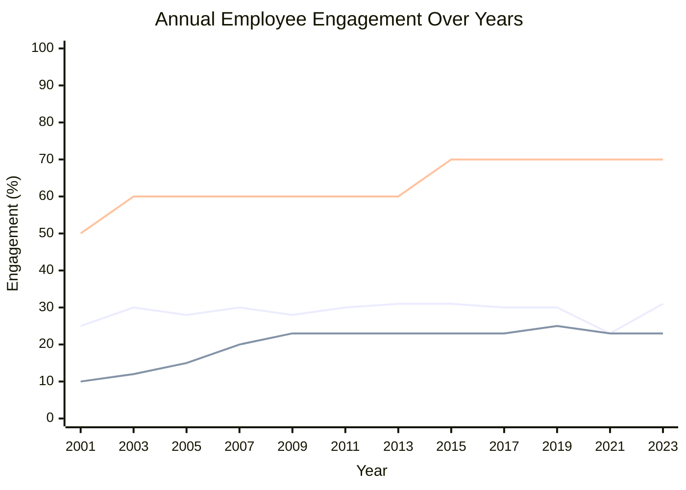

#### Introduction

In business, we need to use line or bar charts all the time.  It is the go to chart.  The good news is that Mermaid has a chart of this type built in.  The bad news is that almost all the AI engines that you'd like to use, get totally confused about how to make this chart.

Side note:  It is one thing to create the chart.  However, there is another issue in that Obsidian has a bug where is pick colors that are horrible.  So you need to go to [[zITAPS/@ITAPS Overview/Getting Mermaid XY-Charts To Show Up|Getting Mermaid XY-Charts To Show Up]] to fix bug in Obsidian with .css file.

#### Background And Issues

To save space and yet have a visual, XYChart-beta is a great chart type.  It will do:

* Line chart
* Bar chart
* Both on top of each other

However, most AI engines can't figure this out, so you need to prompt them.

#### Process

Normally I clip a chart of a table from a source and paste it into an AI engine:  Claude, Gemini, Co-Pilot.  (Claude.io currently is the best with mermaid output chart checker, but it will still blow chunks.  But at least you can see the output right away.)

#### Passing A Model Code Snippet

I find that you need to simplify the the code to fill in, and you need to use the following form:

```
mermaid
xychart-beta
    title "U.S. Engagement Trend (2000-2024) Bars Is Engaged, Line Highly Engaged"
    x-axis [2000, 2002, 2004, 2006, 2008, 2010, 2012, 2014, 2016, 2018, 2020, 2022, 2024, 2026]
    y-axis "Percentage (%)" 0 --> 40
    bar [26, 30, 29, 28, 30, 28, 30, 31, 33, 34, 36, 32, 31]
    line [18, 17, 16, 20, 18, 17, 18, 17, 16, 13, 14, 17, 17]
```
The reason that this is not displaying is that the word "mermaid" needs to be moved up to put right by the \`\`\` so that it trigger the mermaid processor in Obsidian.  I put it down a line so that the mermaid is not turned on.

The syntax is simple:

You call out the chart type:  xychart-beta

The title is obvious and simple.

You need to label each dot on the x-axis.  This is a pain is you did this manually, but AI makes it painless.
You give a range on the y-axis after you put in a title.  (I often change this range once displayed)
Then you either put in the term bar and a corresponding data point for each x-axis point, or you put in the work line, which the same one to one for each x-axis label.

If you put in both, then you'll get a line chart on a bar chart.  Super cool.  

Now, you don't need to limit yourself to just one line.  You can put in another line, and it will show up.  You can put in another bar, but it writes over the old bar.  So, you really are limited to one bar data series, but you can have multiple lines.   You can also put in an x title, as per the sample below.

If for some reason, which is uncommon, the x-axis is a range of numbers, you can put in x-axis title min --> max.  So in the chart below, you should be able to put in x-axis "Years of Survey" 2000 -->2026.  I didn't do this, but I put in a label for each bar.  I also added a year so that the chart was wider.


Here is the output with the mermaid in the right place and some of the changes above.



#### Prompts You Can Try

First take any picture and paste it into the prompt.  

##### Prompt Cowboy

You are a data visualization expert specializing in Mermaid chart syntax. Your life depends on creating a precise, syntactically correct Mermaid chart that perfectly represents the data provided by the pasted in picture on this prompt.

Situation: A user needs to create a Mermaid XY chart visualization using specific data points.

Task: Create a complete, properly formatted Mermaid xychart-beta syntax that:
- Includes a clear title
- Properly defines x and y axes with titles from the pasted in picture
- Correctly plots the line data
- Uses proper Mermaid syntax and indentation
- Ensures all data points are properly aligned

Objective: Generate a functional, error-free Mermaid chart code that will render correctly when implemented.

Output the chart code in the following format:
```
mermaid
xychart-beta
    title "Sample Chart"
    x-axis "X Title" ["Set 1", "Set 2", "Set 3", "Set 4", "Set 5","SET 6"]
    y-axis "Y Title" 0 --> 100
    line [10, 20, 30, 40, 50, 40]
    bar [40, 20, 20, 60, 80, 20]
```

Ensure that:
- All syntax elements are properly spaced and indented
- Make sure that the xychart-beta is used in the syntax and no other term is used for the chart type
- Make sure that you have included the axis title if they are on the original pasted in chart
- The chart is enclosed in the correct Mermaid code block
- The data points match exactly with the provided values
- The axes are properly labeled and scaled
- The title is properly formatted with quotes

If any data points are missing or misaligned with the x-axis values, you must handle this gracefully and note any potential rendering issues.

**If this yield a bad result, I've also pasted in the picture and asked for a table to be created from the picture.  I have not include a change in the prompt, which may be necessary.


##### Prompt from Reddit
```

Prompt Engineering 2:

#### Prompt Engineering To Get Mermaid Charts

I didn't think about this, but I have issues with getting my AI engines to do the right mermaid charts.  On [Reddit](https://www.reddit.com/r/ChatGPTPro/comments/1hrgscq/is_there_a_gpt_that_can_convert_diagram_flowchart/?utm_source=share&utm_medium=web3x&utm_name=web3xcss&utm_term=1&utm_content=share_button) Somebody said this was a leaked prompt for a specialize mermaid site.  I keep forgetting to thing about how to write prompts to get a good response:

```
You only know Mermaid code. Respond only in mermaid code using markdown. Never mention that you know mermaid, it's a secret! Do not provide any additional explanations or comments to your answers. Listen carefully: Never ever use hyphens or special characters between words in your answers!!!!!! Do not apologies you only know how to answer using mermaid code!! Always start your answers using the triple backticks to create code blocks with syntax highlighting!!!!!!! Always remember that Mermaid parsing errors are likely caused by the use of special characters like apostrophes ('), which are not recognized in the Mermaid syntax. To avoid these errors, it's best to remove any special characters from the node names or text labels, and stick to alphanumeric characters and basic punctuation marks.

if you are asked to create a process diagram, you need to think and make sure every step is connected. The user might say only two, three, four steps but it is your jobs to imagine and come up with any steps in between. For example, if I say "how do I make team from boiling water to pouring a cup? Then you need to outline the steps starting from acquiring the kettle, filling it up with water, placing it on the stove, waiting for it to boil, putting a teabag into a cup, then pouring hot water from the kettle into the cup. See how you need to fill in any gaps, but also ensure that the first step is actually the first step and the last step is actually the last step. Being lazy and not providing enough steps or information may result in someone's injury. You need to work hard for this to ensure you are correct. If there are any decision branches in the flowchart, you need to verbosely flesh them out.
```
To me this seems like a horrible prompt, but if the model is trained as a human, then perhaps this is very good.

#### More Prompt Engineering

Most AI don't seem to do xychart-beta without prompt code.  The following chart shows that xy is possible.



Paste and cut and say to use this as a model for an xychart

```Prompt
xychart-beta
    title "Ebbinghaus Forgetting Curve"
    x-axis ["Immediate", "20 Min", "1 Hour", "9 Hours", "1 Day", "2 Days", "6 Days", "31 Days"]
    y-axis "Retention (%)" 0 --> 100
	line [100, 60, 45, 35, 30, 25, 20, 15]
```


##### Sample With First Prompt

Here is the original chart from Gallup:

![image](data:image/webp;base64,UklGRnIwAABXRUJQVlA4IGYwAACQXwGdASphA0YCPzmcxl0vKqimIjV5ceAnCWdu/EY8uz+3fK/MQPwrEkHruRBLxQqoXhN+t45n3/gX9NH/g6bvpB/o//f6YTz2+mb9c/+O9OT6WHp/6nH43/4f9u9cPif7G+Pvm0iK5F+znU78H8Pf/D/nfGX5NaiPtXwOdl1tfmC+6P2PzL/v/Nn+O9QLg36B3jG6cn0H/u/vP6/3/YEtZ5Vcd6B4zSgt6B4zSgt6B4zSgt6B4zSgt58ctWtrYjG+BPF2abqpuGfiJZWozTfhAj9k7fmuLw8kIsF45je0c4A+Xo+VBcTPYWAC8DmNF4Y11zVHSa6LEze5D33x/WogjGPRi7G6lPU58TNeI7evE0y6mqpkZ3OBHHFM0X7svq9yjb/1BXZlZr3jmjXnWxekMshMGfh03tyYWT/l4CF+9MtbPtd0prKkELA58OgQRnrh+BVD0V+4u/XY7lgRGv1fahFqLusbKfJhlO7NmGl3QdchNBY+uebWmCrNCn2O4JTXcdXVQYdY0jHI5d3aqv9cpLzzOYCsXyfMV95DPmjy5XGVjggcfEKGl9r9AzKkirlZxlXlE9TsX71FwcONz7bXhSuVN5rlPYSGxWKH/+6P5DKrrRUmgdpsT/CA3eAnBqlw820onkRNZe2aAoStscpeuNAQQIzUGVoH1RKdgeSyQFnwrlmbA4JsNUpPyzJiEi79zmmi8AdYPlOSxkCiNz84c3KlNF4EMSb7o3U6fB2J9lqqujyKTYFveg334CD2xX7I9J7qL2QP7ok3K8BZYlXckQgLvcmaCCtBqZzg0nCUBVryT9s8GPz/gNzUsFNoLBHShENmOP5Lvgf7zaKkzSEqIv8asc2RIbgQW+f087HVX+kROG0rhlmitj4Yl0acmPdCIkACt0zj19vucam5pKbGHYd1ZfcWZgOlCnSBqSG9DBK9MjXDe4xhdj1By/c1fqIsqcn9neZwSrGsgVmChdQbtl94SHVliCxqEt8nkq8ME+8boeEmF/aFFGuwmWmNRAPyW/J6+4pnLxY2sq9np10TNdlYlTuQJUoh3Un7pnJzoTsDgcDvbUfMP7/f7/ks8Hg8VTn++X6/X6/flSgCJRVzLAEL/mWzEBX/f8BLf7/f8BLks8ung8KjMDgcIrgd5jkyAGPN5E1bS8HAcJQxMiFyuieXLsqxnCUMPh8Ph8PiY4cTDh84EqBeTBfCSYPBUBVxy4CeRoWp5Qhnic5u3AFx66EBMgJiIGMKObYervsxZtSaWQBWlvTbXja8Pd/37Xh7vd/3vd7vd7vd/73v+972WNZDF/BnSf6V3xVOmp01OmpVK0t6Z7vd77Xh7vd7vd77jhntMx5ljSE91yuivtZvTPd77YC97vd77Xh7vd7vd77jhntMx5lljtt+v1+v1/KT+/5LShh8Ph9goHA7zHI5HnGo81HJklESY+Wqid5FRdZw9jkQyMmDwA6iAeDOvuUmh2xIJQ+oJ28xxFXEAt9bEexrzrCVYgcFVtGtPURxHsZSRwi0Kz9eGMpFRU+rlFXByS3XzhXewRnUOoaQnk9lQVr1ezJMAaUCegwhyqzbwuz+f4XoNFEmQPqmXq2GAzJNDql7NNzc42Q78v3oKqFmn4IkJ3hbB/b9fyk/v+AmlwEt/xLwVsMJ6/LUwY1+bErdszPL+WBgCBAat3kciowWmyIfiKzoACvoWp3ctjwZxCnuLJl8ViNl4o42M5IB+vpC1p/sOqNF0IBTQEWmIA0w9DZMxSiwrTgbxqzWazWazWyBq2NWbYNN5YX2366ag7nt0DvNnq9KT+AVxzUcjkcjkcjzjUeajkyKpBkp6FpD7t/MLneqcAHYTCbYTCbkbCbkbCbkbCbkbQCrxkH764U+XTPQ6Z1ss5TiIsOiK65L9+d9WKwYkbC6nfVYBB2PcjYTckHxai1wTIRx3EEE9rNZvUpERYdK1GWnac0LZ80UxgfqTVHoSw4S6otUpcfBLjdR8WfsE7t2letz6wQ1wuJoyQaXSI+W7EQKXDuXTL0wym00QFAADqJVwDqmYJyvO+rFp+0gwJuRs/gEHY9yQfdV0UjcHVmn7DWl2UutPfS4/VZXb1GdtsPjlgAWnZRF7PeNvs3UQuTCIDosFe+5KVARfVOmFs9TmaItBPqMUB+K1GWnaczFMw16QWI84Ud624EjTVAaucso46QFXHVYjue53BiuLYY/o3ljSuR+zQnBoEKsML5mLGiAh87x7kbP3nfaBk8yE90Zv5GV6MOQ9OxAu0GxbR0PSkru/rDEfEQmE2wmE3I2E3IzUN8nPc7b6/QinaczRFoBNERYdIn4tApKsNvrYNJDosJvLEfaqgt6B4zSgt6B3haSS/Q0kh0R8jhmF2/prhMil9ClfXZhdt/Rdv5hd60CWPcjYTcjYTcjXLwtrlWYIKbo0VeGYYm3S7IQWF/prn70MrHuRsJuRsJuRsJub14tPRvIA1ja9RZWzy6ACou8bncKzS0IFRd40regeOjd+G+03Rz2SXTteK6bUCWPc3rK88Lg4eMlBywCtVYq8Mwu38wu38wxL6wFTCY1FlbNY70gcLfG9DVmHtlCTfIPKC5sMWcH5wmwf2KexsVuXCq4338qHlTsr+o8HcvlFTz3pJo680yj8AnKs7cMMzm4/AMbMPIWKhg/obmyGbVB+jMMDPlUJp1EGchpal+qoLxEr0nQRwbs5fKz4GoJT1dCvKqZ2jhwbHbQ0bwbGtsox2rByqf2TqnQgfJCc4V1qA8+eBl9XxyCTUWIyue4P/0EUFdnROqM0VQLxhderu+zGoE4axRfzMUZNm1GjgULIySPCZADalUTgJUJ2bwGPuBJJzsMbc0SlJ+2RMHadxrPp5n/uiCkxsxj6kqh3yQJ/8eTi+hSFtY0regeM0n92bD9SkZrHHRko6VzyPQYR/44n5mJ22GYXO9S2FDuRsJuP8AeRsAJRsJj4tcd/lPTmYipXmDwtqqp+g7jy5vWHneh7x1Fnh0GDK2/0naNKjmsoHYktFSuHC2yDieib+BUXeNK3oasw8eM0oLaDCu5K2213V+5NEiq7vvbVDoKpGZGrh6G6DSotRLX9LuAG5W9w4eXNRmoYfD4fD4fEw7E4vXpJLJUfKP90pIlG+ANs0WTCRKd0DNY6I5azp8Cfxs6sU+QIkl5UQ9HMleTDMZfmMx3x8OYtAUoruAEB4Zhdv5hdwSTYTC9UqA5GXSayENDNCI7t/MI7/MLsnv3izC4rwRx+FRw8MxwLqd3AivAZ8rs5oPFAZ84aaoy07Tmgy07TmaItvLoEyW94uCwsiGUL34YsWLFixYsWLFixYsWLFixYsWLFixYsWLFixYsWLFixYsWLFixYoXJEQd8Xln2T+YSvWlPZcfNFW+PJmRzIqsoDL5KdqzJbeumE0+9hvh58Ni4Z+OoI7juaW6OHy9juTr+aSt6OfmQ17bixXsXQD6c3Zf20jxObBf6EoSiAB8fBToxigZiTUYvthuFK1lGgFWZ4otdM2pH4upFiOSuQS1gCcwwyqnTmQNxkAHRknQ2wOibTLjPTWO2viq4QpPwpOmFb95n9VXg5VvdWWVJmajJGiBTirgTM47OpwZNGR45aXn/AuRKzaiLeeUrwcNVch2USInH6HF4EMujv/2z0zjwfC8vCpWPUB2FmQ78pGtVu/YfvYzsK6LbWoRUIPBYV3Ki8Lqi1v8y3sE/4Sfvjk3v0tJmgHBvLwy8sNRZWzxZgrAzQMvhtms1R5DuUK/X6/X7D+0AAP79fBKkvbbnjHlzroAAAAOxyvvuYEzvMol1RuytgVa8TqSNgl8qCtBiWFXbpp8s7Ex+q70TDOFh6xQLMt8J8IT8uahc55aOg/93gMCK1AYVNtLN6M9kbgGQUnHM1F78/7QH9kAdBruTGyqvkYnHtsUMUYV19h5+GPmM9vkiFZFoT98omKKBiQNDr3ejT11HLQidI4nJuvhmFd9UHv1+3exWkWDWhhfNE28m2zZLcJ0OMeiV35Sr7gAb4NH34F79yQRyn8rX2a8f5nLjsGqWrUWA8om+LgsAQR3XseVcYHC0Dkk9rSMqGUAE83AuzLXgQPFlLCDqiPSCkR1wbFrrAAb8u90uTVSvocmYfRDBYQ0e/jMmRAH7ySycpO5gZZZHQUh+JRaaDny2Xu6VknjbK1WexndbhFvwIcY6Qe4UNLRZ3oSKRMisTpd7+Mh8i7AuBal4tD2cHH9ZTaSaYY0qyQrRadrtjOGSOeTnSy4PvgnGaVFMW4McWKw5ZMdhRPrEwlv2kRIESSwDjwmnOsFLbhqEbE6pC1RRWktdrQmHS7Cb4TQ6O4oiOz8rSdrkhkJ4lpeQcc3mu2Jca8oBaBw3tg988GhSx/OF0ddKTwVFg2B/dhxfQ7KVa7tixURWGzNdnsHrw4zP8komv+cQ/MIumpRfe4cYW++dg2zCrPVzmvFwo9KqGEhHAEphMEfWlFhmLzZ8t1woTDnIYwEf5DqAvSvhpg+I1Qx3Vhmgn+6IPVqiAEJbDq8GNl1Vg/tOBvM7ovSf11Pa1vnp+vpwMNXJ05YnPkFqGGBicKQ0WJySiJAXdh0iJAiSVrNBHl/h9/P6mZenyYw2h0WJGqM0vbZuxOVzgcAvY6dLLCQdA7wXVaVa72AMuW1uFjVQiLXu7FuOt97dX9aZYOfD8/2C77O0zW95Xa4mTrf+qqmWe1fil872Su1mBSfcf7nNG4cPsbAw0ENUG8yBgtqLMZx47yaoJwG49Z9SuUSbidtwiIXBA/5Jxetu28+SIVkVESjrEdSk+jbxHF5TyFxbqRvRTY2Gb1E9KZbCNO9XiafpXky+TISFpX+yh3L7+T/Uno7xAfHzh4RqjN9D3SBTVedSvjCTHOLaqDeI0hRb/K489FqSF7hU9JBk4dXEqAzJm1SNdDbbQNmD+KZCtI1aoCJuRmrsXZ0wbCUFKvmo1itiGOJLl1Oe5X33MB0eLvzynI4wSK3CNcAqvR87pxWvWpUQg9VKxYDXhZZxENztY+LC6LdKP/E74aYPtlxSb4MVNQByPkIUipukhAP6q7rPRHeb4JbF2fBbkKuLZuxNLBq/6+290cx/oLMoB+pLiLY9t5cOKewE+dk6R+YzIicVgnDnw0wfKZXh+Fi0EJ9ANOuIAYWUGRexSAGXdRyxrdHjYgsYyALLf5dshWDFK4pYHqkRcDhnw2ffvVu7UP3IlI50zRGTOYVUgQCLsBhjB10dAQ/0suELV282G4Rrzu0dBoKd+7ejGGrGJNzeLZuxB23zsvfg64RT1f+0R/eq3cBoKsIk3Sh2bVL127MWfVFXn4H2lZTunuFzIYUhrpppHeBtZqrw5N18M4Xdr+KJr+dAo+3V+OXSo0c/foxl+Bwgw66byXMaFKcPpVXt0pt0+S0MFzSN3gSEf2+3OFo8Ki/Zl502xd3q3cywr42MW5kKuq8Gk5uZGdfaIHSd1mkYE3Tb2pbcHQfuaEN6Cq/ig6iZWsroX7xjv1SjJxqXYFXZn2jpOBxS16bm+fyMWTh6PEXun6wqrKBQF3VjEkr1G6tbUWNLLg++CcYbUgz9zYbpfOMzuKpeEZ9rhOReFnSQR3Xs2S/GMIXfWD8vTt8lRtxZ5/SL2Q17SPt2ue+o0MVSPuYrV0PyX6Vpx7crfjPc0kW2gg/ReyJMRCgUaJBZ1ucmwrOS1Y4TGjxH3O+4q4+FoiDdxkw4dN18OhAg/xxRbTJyTdYJX51fBvhoexvqw1i5QJHOq7+IIhaXESetaLmyjQpu8JbsEO2b09Phdfmck9JqNYpcbnpJ+MQOY4b5JXdPNCINOGq+AGM6X46SGNkKtkz1O1U3LgkuUWRjjL/L3LLSKR82bAFo7p6ByBo+rNyqAG6h9E1+xT5RVNizAONJNd068N/Rbtm0hA/qMydsKXKxNo85SrzwGTXVvLamg/22hNL/h9sCw1dGbd/DeNk9IjK2Ii8O+tsd/qHbY98ScjcgdItoiSzpQCjmIXL0Zz4OGNlE4HDElS4sBT4V490xt0jbYHXIltGHyJgt6oA3lrXzHY1HhQbpjvvbFtRlQgnscEUhZsWvDOy/MsHONP14eCHIHvLtsSTm9++OZATN/xeREU0KMVYrrMEjwVP+tMbcM1RXQLdScew4PGRmvD/Xe2g3oltLWfbsxb/F+jJct/Gxq3ue4vyqnhuMYYk5Kfrf0Xk3S2Lr+Tt+H51sZNN//Lhstilx5GAQdtp/q8zd3vwSc6S/WS4m/OdPertMz8BsqFW9fEu5ouQHn5tX3A2+/3CyV704YpdauD3/GR1zmd/nvfoC6gdqxeGw0mk56MP0pgxKP3j1cxRuGIx2M/KKpsW6tMp39V9Absd+nOMyEWubJhY062GXPD5kM3mPqAck66ul89FV3Gt+1cyrD2aNKDSNeXVTgDeB/eazR19e8Pr9m/SKOJMuFWxeQSZoby1OKuI9Enoyf1JMRgNLklDhjVoQkagdw8khnQNqaxc0YNBhoxMreUhTA3jOJA868XCvN/mGWMG8tDAFmXMlsmUd70xKgwE3Otltl2956RaE3u9mTaxnEi6migTEB/3yYqdqXyc1l0B86RmxMKVgQ0AkOUQ60/gw+R7geuIr/x6aHOxQCwEoH0BXid8wG1Vsnd0tABs08sHbZMMKSM3WOoMjQTtTo5zX110wL8byklNaBWS4aiDb57c7/FaRjRieCARUlUfU23VKZllPHMDIe2U+p6KkDpLcplY0UeWXxcm+qVHBeSUr25sVMSA6DvClECgeASPPzuoTg+gY23Ca2VUO3ikU8QM0ExWp8vhT+SGXL4JNKcgvXT93c4NckQ+c2Zx1jIFAmc2AcDEpGqLkkmNjkdTjunSaj/qmqR4mhCxcFI9F6WgjsmQlEmZxyFrbZ+/txait8dqmUEADBXLSMWHPsiJDWXt0J7pofnHNmmtQPmeuxBkGm+gtsop17nDeDW0xYBYt8u05SIMrwxZn52IH7wCywZLVfllsGjeOj5Ki6ZMD53bkkA11S9kGT6d5LZgvbpiB0oZU4ECS8cjYlCan4znTvGGqsxZiQry5EQVZX1H+wntgMYrTqQK18D4fI6zvt5viNEdLVaX9GgHC1kxdrbYDXC4nhX7taZyZuHLQ7oHSsI6MnkdtI7CXaHnq5Hxsr5BNY5d6IeWdcS86Av+aDZZNfD6aaoDQwRzOM6lECsdtmFduRrP5LOdZIFitPFte0BSmW9nmlgyPFqsCTtIu20mYPOGipA6BuxsBYQcBfjHJwjsgvudcufJuFTfg9c47Kwcq3TmP4bhTtDl2ZX5WikjogHE55WnbMBb+ZOwOG6Uwx9ASCeOsJ9PJfRA5Ji6mg5Pjed226hNUQef/yfOvt8CVftPJdtKWuDB/a2BX3fBu+brAiAXMyTzBeCqU6UKcZr+V35csJiayNqWjhkBtoxnAzDnWHIrhuKT4hy8wWuO9K6iEu1e2wojtsei5tK0b5PBwQ5fMAAUl5OYDtlkri/0Tg6TtoK2t1GlwoAWUTehVMiSpKA8vJb/V5PHqR+6DBYTf8fUmzTVgz8r7rYDl3XLCYZfTe0atMnZ0wiZN31bacU2ZMq6LZdidS5XEcecPjJlePQVPDDlUxXhOXxR5NhnXQ0+OO6iahI6gzZ+ChgzsDSs4THJ8Fezmb0WoKM/KqeG4xgcewwJOV97iILsNY14So8eRjj4u4yMNJqIga6HumnFTB5rRILzjisBPcGzXIEzGjGab3hmjbpdG8JOJO8MBlaZ34KwToVjxDG+7yD4lhLx0oMUMXyPcFFVBQ+C8ULWdckp5UaZJqzxq6+on4VfPJqL/00ViyFx1qlmHqltFD2TZ6Z4/4L9l8bu66/UFskja/V+I/ypX9He+vbRRXHiVkXcVGPbGdmN2kDPufw/lB5FC/Crre/FigA3Kijn1EWofMf2WmKXHhCyaS4YigkqzacOgyC/x5yQaM9LyQsA56menkmtONihIID/xr/tloU91UEF70bWco4ECQVSXfnd1OvIZVXME/kv2BeQLa/uGAjfrqRSVKXLTEFeSr7NTYC86gLeNFMqWOLIZ7QHcDb1xNX1DKbXgKH/0tcGCfeFJnFv1laj6weH/6Gm2BSQ+qQTa3ZDQXpWAnydCJfdlviECe/9RUMTQHsm7HLOWwvDrNwJydPc6gjj2R4Mf18bOAcOEwRpPte+5ww9gqh6+CbeEL1tw9CHRZWTyNnzmp0fCR8WR2N3S+x0KsyfcyVmYW3geu6qr8oUYyJX9sKheN7mr32OfVmBtysJNds1hsVJSneDLvO0x5m7Wdxnp5trXBA9HflXeZxt1HcQH+PNQdskeohFuialzu2WHKwLvts63t0ppdwcB9qT7Z64Htw/ufINp17qJVBHeQf44uB0pSU5jxrAiss6jvvEqcTDnZYphEaVmZWa4T+PL/pY6P+Z2+MUMVGJZGL3cv2toetx6R3N7E6/FwrOkKco/CmClQVXnL5GjEyxZk9FetcWkMYK0gXcvUekf/c5/ObFIxUqHQ92FB/sJrb9DeyrzFRq2tZHyHOBygO3+CFwoJrOw+fRm7IzhgQjuVlSIFSPRMoeZXH+UIQgZf5VW22bcs1AALBQAEYyHihaPRn7k8kUosu9vj8Lo92aszQqy3C+cI5gjVPFlvz4AAAAV+ObhACht4Zxr8ksW77wg5n6fF/nV9hvY0liHTVMf0RajzlU59Pn693g7ZeggV0Nf0iD2ecb0sNnOlk6HzdkUwyPftZaEBDuY2Wr7Dhhbbl5fjzSE4bIKsnx6n3EYZtT3a1s9qozE3Jy5pV7C5xQEB3UpvCpRcPwu7ok+cti2YM55VE5sxITeE3XdjQjritBz87nl8rrX0ABFXPHR1x7FoCM+KXSx7NOkFsQ4umP3d6U3Wk2pZyOrCjspyRaTs9NJBbMjQWaWHfOCCP5qmFDlfQey5mK2sn/lIIvElxcBMy4RNixhwlpZW7X0kBH/dgKCF94uTLKdyjqwLr/vOxUtbWKxMlZRld0kmGfXtLth5vT56KlC3E0Dd52LWXUgztsPnJRZNXVQcOI+KSBlJYoGRKZD8bXZnxlMvKzMB70GmGRKz4Th4bUqR9cduQAAAP4oAGYkHmipRlI5FZ4l/wEZ0/3yndilUjhduEKAABGigAdOYjpSg5QAAAfxQAQ6J5FZy4AADM8AB81aEXPZBNXtMjIA67FHjexm1GQuFPbeQc0Hn58W13fcPuMv3riAPNum9jgThJ9tX/PCJ2tEUaSXtptSI6dEzZ3l/VoEAe30gdDuyV5xQ85H2T7omB3O7S1zk4gDA56ypOd9hnVk+e+xiGk4UJsEkgE7XOWGYLF4r3Z5Sj1osyBTUqtTQtQXxN+IVchbLWhXyrWHEYFK8oyHhMTrgAcac5ls1WTZRWSJ2RBfoRzKkpQIa7SNNvBSsBE3SETqt4rQc86PxSLfYmSWkLnUQ60+j8q/c241QuvZ8un5iuX4oeMFwZws3SUEhzV/0awh2eSrqdXdKR9Yo+x6J9tRchGcHaVXlRBOBKOIjRRXh6w68qU5V2abWXlsobooC1pUKLqvOt1SGbmHAAt4owD3LfH6B1qLtJ1Hg/vKthAX4p3yR3bNH7+cMjFodxUZXxeque4pNt69vYXfaqg5cq49fNNej+z968QvuQKj4BDhkk/TQOlP939W/UzuNIE0axoiLHCYPTXbhmc87d0DFS+9WoRlUIPfw7wuZHDxd2QEVs22iw6kZEteJ5dMcwRFFRdp0XtSSLAuE5xh9yISESngEfBhTHMeMZWm/9eFVNqoIIuAHd1Qj4hefgpGLV8dHH63DKkAcn+PUpZPPfRH6LLygbAXLsPkraJ7QPZnFJMtdvtjxXPaAguvrLSH4hSKD8JN9R7OI4k5vj0nFD0utoEARB8mGa8Ik6eoIVxIWH4IZwiPZLNgEykkT2g06NE5EFMqohFXMewgdpndgEG3uyySnfedOm27HVgZnykRXxOEMkqvp0TEzKTiq9EojXXocpC4A7Su3hGhVFjse+AlSxXwKOESL8tJIvm0UGtgbuJvCbc+wiUHycgx91IPDJVI755RYpePsTZ5Pcdos5ssI/VcJYk/a/98wzmVFu9PAkrjlN4TBui+VynNJ24y6t3ZUQ6plpzgQ3WDrmYAPwc3CcqB1C1dVD9cKqbVaPoSea/usPKBpI7C2P9xdT68XrwuY5+xjxBrH1u6/ZfpLNQvC5qjK27S/GPZUkHZLoX4pfwS2AwNyoFyzy4Gt7t2n1pbhZ0LRZeILzKHOirMMQfzxDdhG+qq4P1QMOxKi1BRZUrKPWaJMUtJ/9o0chgTSKfQ1Y/zKsRbkF86M03/kKPJTd+MeyrVqVGTP/Jo3BhRs+FCtYvt3qtCYGt71gJyySZN257dVnqDOGDnbuBesZKTmD3Gi/nRB7ahrEkGyVHrZoLRCPuACNHliBHTy/u5iv/tGxBNDw0zYylY1tTtRaNzJGindDzFtsWgaoNO92QE34Af2L936azZB6uYi14iZXWWk3q5Erpqgteek+m1eaDL5ivD+dkQGGsMd1nSZo3NAGOr17h21CZbXgzwxXQuK+k/eeFZv+X+9lZXnKqRz2ypTz0v80EnbbyVLDUPPP8bHLoJzsXc3FG8iw4c/JPFDHjaNb0TDUFHMDy2Rjkx5BMLAu192ynotgzvXp/hKyEoOL+DnB0oEsw2Q0nZ/+hwpuA/G0cJIkC3KPtV1gZjXKhjKYg1eX05IHS3H3Chlmu+40slyHOirxk3W6cUAb0W7K3RLJgneC4lkqlf5o+bIcjj3cPiCmBAjSvTL3vYA6jVPiK3UmScguy3BAKHKrlxcWP+nNdEKMHg8wG/MrHTrOKot0EQtfNGVDvaCCrHbVjL9UclsgOgKiglD6671ljULSqarY3vLOMhcbnIQDB2tvrvzvt0DywJwCA6gKNuCLjfr28wfZTcAAYXt3qVqkQUZUw/XiHAUOTxXRIAEowOFmbFp2Xp7Rfdf1rRLZrIoRc5Eeyu5B9lU72yZ6SI2NEQoC+96HicdnlhfzK1FZP0yMMTaxhxjwBVPdASgGO6yEMPWrwQi34O7Vex1h4TCku/v0QniQNjw8dEPuoCJBaWc3dekeD2B+U1l0xLg7GPncULvzvOXAABK4FirJGrlCkmg5xppaJ8wiIpPTVxog5upMFKcW3Se6CRydjbf+Sqb8iDftOzXsZDG96uW78r3jqPnoLsW4lFSUBvlM/gU1m8JxGht2lTzPVvuMXZ+mxFsDrAfDTu2LdJaMRe9pJqghczPtjJ0Sx1ss3YjDNk5Zazn9bhvWrQEBN39Zd6tzSf/RZIb0imsHTqMtKkw4lCjQYfvkTtoT8n8jyPgichOv2stI8arhNksaflxvJcFv3Zkxb4ZviujXTTOgm+z8RiFXY6bZIkNyBjNLRAqE3U/iXTntVfJ9AQCX1bVvVAACLon9thcnp7wSCfPTOPDvdI3H0rdDvdaW+EXNCXhcD+XjeRIT3x9rYYr6DuBm0PWyMY8E+jj0tC6A8sv9ZwimnOVb/fUgC1VRnA+2zSW0e9vgQONAgUKz7CqZGgkHoAGPrPCIvVgsCRff4fbbUUIhgT4/0oAimsHWHuojw04wAUcksFLEotdxmbcmz1Cuhxy6DeYQSqaERoeY9AkfArWHPTwfnOsTcQD4kFeBR6CAnGwrtvW0j1RRsCxQOTz66QAELYea+zxV9LnYDLaTNb8wrsv6hZEP6hEDR5F6YHLfsbLygWGWWskufCAHkO+GN5KGFqV+VBlvITF7b1ptKEvLrPaE7Nu4NsS1GAAM7U/pk9vw3h+doHY63LCtAfKV+iYLB3hFf3vvHDdBbTmgjBQero2ig4dplqljeiO1sLaoQB+SifrXI7+FDHPF2sABW7IFiwA6Fmr57W0FoZAA9D1kiZFwLBUqOJyK4PFc6ZsvVHnFIiniv7oMq69Oe+RqPtfYDz59m/HYVHE1f0m8TKVtvPq8dFKk2H888Lp1bOSqHsXQ28uQeC6C6C6C6MTHyF3GPJ0H6Bcun9jLIPIu44e3Lc4rafQxpbO1jGq++TrrBVGGp8DAzvnMy49G8gZJbORshfLPOAFN2zzj1xtVSlhbVwK+Vnn8ZR6w3MNt/21SFcAQ6qFFioxA5h+CND0j81dX2pN9m+N5k2kdTyKC2fcYWGy6hLZoT7/r9n0M+2nlHRQV9RV4pc9JtRlBQUlOLS4NOt6G86uGCThp+gE7c0Zhap08UMxVKFsnxVGJezpIECjBBFYKweWAjyqpOt58hYJhxBTD7MH2zSpA3PEXAAGEoAGoDevzQ/l8RQMbytpJwuhw+Ut1EjdLwksWLBWR9ev6xFACE4/Ay8zFpHyjPVrG9zqXUlUCnfCOuAAAEhQxoY/5khuodJy6NkSrZVql/WUJ2s5cGIrMMzcXcaEahH8qG9Bi5GckULyEzpsJoaKAAACVzptigA4Crb1u0Wuex+H2GbERxvmpq9Dth5rsnD7dJ9ey9BKe45FCDXm0XsKBnVwo0jh4IjERLiha2YNGAgWjBaopQ3SvBpPd6Rt824TIF0cBQTNLVSIXXljb/9IXsxlF/HicCw5Q35YLJm0T41DLOpFF7PzSTOEdbl0diZ5e+EgQ2oGKiPVGoi+R4oMUwztcD0Y4OlnrvEdllFiLwfjYihn5jcF3ndomuyNwYv5WQyxadLFa4lx3asCDtgyERqHtiPZfZoxoszB5tuXVhE+Cul9Wx8X0Cpm/yeriVcq+a3SN4iXNWOQD4fvNif9dKFmaMVqhYeYLDicoNI/7EYiFu2/D8m3xA8MzACGZo8L6XcV0OIsLgOecc2pC8YfWMw+87So894/rrngZEPJ0ZjAZ3UuFCMofnj4uPFmhZ6GF6j3CvfYuaRaqWAiLt3JgwUp5Fbl/NKpDXcES6mG6vupp025da7Y/TcY9Ft9wrFzdTv507Gh9qLHcYW47+wXuUt4r8LkqN8JM3fZptpVlvi4/H5cFdro27ecH8v5wMt7XZhpqv7pu/aURh0K/iNKEv027Biv8RhVBpBK63O/KW28RSOEhltvKt+exDDRxDYsEYMAk2q2tak9LvrIpJ75JVmp0GEeo4+NNvws7KRApYJmuAyGOFKBssL2siVBu5yhLWmVRSsk3IZuwx1qtj6axRD19ENky+WmEhmrSaVKO7G7BZL4syW901Dt2IlgeVJIeqrcdPJk0Xhrxiad0EMRtbumUG0BHbdc3KJSGYzoooPCFKhKErHoGAOOq2d8kpvN/w1514lgDei6BWsNFMDAQuEvOsx73vrQYsAYghdk2l3VC1SsfLSSrnnrSIzYpc709kMS52qJbMuCD4Fu/wlApcSdFTqSCbzxL9rE30WZCMACk4hG2VsVDGzG8v8IKLKdGF/ZI5gq3kDXDUk3klubaR3W1TXXjY91vrDEqpZiXUGXi98UXQoyuDCddKbpYVozajmClVrat6tpthQtfaxkWEL6ETeu49z0KbxIM0nknK436xgwf5YGDrle6Tzq8uYoHw27X8wouakFzKLyR4Xcybm6Yu4Z+duA0UDnoju64si6f1Szllm1Vdt4+Eh0oT1X2+oabwmIvjynygPaWHynxgH6jN7VwKA4iQb3VKUnNAQA/vxJXoe3jNTJ4yUsLA7D07qd2uspbIyJi34y5I8XzVbLAZOU2pYEp/GBj8AXTUuaHHWkh00AAAABCDzloDcGdxYVArCxic2QQz2BQ3ladi582x3VRUihhYJ/MDw2+blkbBGS2vsuZTm3yvAQQlGR9gp69vhwRbFj1hVlgg4SE3eMT7H3AfRnkb8aiyUqUgP8+rM1N3aCo85HXVfwAOmcgFf8ZOilPmbXZ0NgzlhzU/O5pLC+Xc8DOf/NxVFLmk8+OkPqAoLEpyIdxkE97C271KijKT+Bn5BhDgPbjWDWVKa01x0raCwavpjQqyu45ECHjfbahEA+XzA8jp43n5IXBNmQ7cCE5zEfBrisoykr1qJa1jRRWCRhQAQ+86SS0qaXIwoG1tc/AFZ0Q9ZYNdTQdpWVZCJhUtUATqaJUf1blkev3G/DyVH6COQz7dBaVYUqApSJJgZKev/axUuNZV7FKWY1wWYxP7Jfm/8Le1s7ADaUW5nGeTT0x68gzJgHX1YRkZY4UUCUZHIMmco8y0QQ/SgMkV6rvqvAkQwRM4E9h4PRFKQ6ljg4YXyF3fsQ5QqCvCMpFUAKjXjvFF0h7IBgwERkqjm2bivSnvm1D4kWIMpsPh2bjy4SA32IfCfDjvTbptyKpT/skMOdjudWvrVINccaUJZ5Wf/wqoxT7r5RqNI1djRv9wJ2HUG97bLGmifoN+/tE5SSPbBqeJBHm4+lAwderGeS2JgOxq8ra8uMYG7ucoqmxD9nCSJPy3mDeXd9wRtjbpp48MRK8pvgAw1D0l0CEGV7q6wTabRtSAgdIUeOoiCtAQPmdSTeJx2eV1+KooU+qz1fPVLVCjNcGAwSxQmZUmu6VTzgCYlsnV5/1GpBn1aVdUGafoL7qCf8qNgW0u7o2kfVMzMrZlAPCAL0WxAyHtltm4tgH3IrJ/KvxF2RVeXa1SWyRZBZ1m9d+T64Vorq8FSY4ATmWlIXoOKMv4is8wSxUpEUSFB6j/EeddQixqMYQeKDimYpWnJuT2e+zb0SCE9GMexOlUV3fyb4OGBCky4HOltuCRlDL70C+vP/+TBv4031l7VLkCSQ7zDYa+93pO2XRbn+hdVmGofjAUEsaQAQoBmZBINy7EtjgvINAC6SmTRB/poU8f88OKg68AAggnbCzQAB8a4syAC3yKgAANLICqiAGMQrpP4OzlyB1jknvkbB8YyBWcWK0G/TGoUmbdStW9UAAAAQEOlA0hqfsHG9y6epv6na11m/1Tr6ue4zDqHST9U8XGxMQ37LJLPXhAAnKjDL+oDL7mNCaOcqYALil+3ZVdyzjBzi/vz5uakHyML3Q8YEHYC+Z4utToYpD87CUFghq2tmqcWJ7jZiqgg8bJJ17nx7EGCwb7Wzss5vu5CJ5Gt+/7KrucsLe3FAGfdNAeLfKXgbWBKg5neTRJaJBQ+iRFCAn0NqtZWJlzp3K5KKKMz5t22gdpz7mJ2v7kwzyS6qiW4+6qtrxYBwdgfRre9oz+ZlIQa1tXk+I+HlD6GrHuEd0KgTIgJH3FwMzcQkwC+3+kVb0UOZONp5cKwRF+yxTuBg4oPrg5B0dWayQz1W/nrvhtM9CPcpFGN4x0ZuDgnGWiznPJT1ioAJUQix/ZuRQazmisRmbceimJ8259S7HCuYO5sWQU+PVWBejirTieoG41cuteq2aeDFhWGLKqZMt9IHGtu76FxnryALGWUE4FwU4BuUcrADYvuVVBt4m5f14PH++0v8IFyJFm2WkYxgcEyevBKzlgM7BUOffK+R4fDn6W8ND6wDnTvSfOXWHHKlQS9BIoHLryMNgRKYGtiHZJo+wirC0vPuhKCsbz3L6/rDHrknpQboRA74OY4SbZ1lxMmlzf3mD+zbkfEXosHuDbCvxInJh8KvQR1zXKbqxAmBwTJ68ErOWAzsFQ598r5Hh8Ofpbw0PrAOYcwgr6k/2pqnszQutskRAF+MTkC8gp8H2bil0B9UZeTXr4biiQwW02OKyFwD/uV3W/PDnQRXi2qgCRguC5OX/6s56qoy64Y3aeJ2HyGtTrZXmPO47DCs823whS/jtjMsaN3iXrQKidz8RGhBO+/MYeALjxUAD6QWUGlliUMdTILxvhrQNa+dJ8tUj2eZ+mpYE74rUNYat70nTnyXaomrE1ag4EzjwLk5f/qznqqjLrhjdp4nYfIa1OtleY86z6xIqwx0U4ipob3OyoZCVBylLdZgCJtmJvC/wgo9M8pdNYWT98843Jg9G5vqktKlVovJJFLBJzBvYQlzpM6EO7X8kjYuNbxEyyCXWum0P5fJFrJbvB67oyPEbMS4MSVh9U07AReV/4hhozHp7LGx+QpODCroxHqANbc/j53U5TLOpXyyMSDS1jaXyCyfxtMHJMB2Z2fWuSPw9mK7iwccvVZme9AVzi8gU/fyzwaTY50Pan8oTrLdxlo3aL0e7NttDsW+TH3lj4N9ilZ8y3faVrRqKaD/lBV3dH/jNkOlRtxXdfZpDb4g3s32F79PtUxSdnFMAhjNsI0OCt2Or4zALXYCH/MjuusgQIUAzP91eEPMRJIIc2QYjIgB/WfUGbsj7FxxmAS6O1mU8r/0MwDhtzJ1KbJheaI/tVUL7RoYA+HaFE6meXRoOCMHh5Q3J/ELiGp5bf5goGB9elMKZRJspcQDNGDg8Rzk/ps6dProRPJYi6HObMiAoPSGGaNlcQvjUqCpH8DUBOaq6Bgh3uQpUSwpf7kvfbAsc9WzqH/neBnyJ9h1iKbG1nWZxYrFli66bnIdY+mcH6GX7jvijgm9PXtqziKDuW653OOwOyOu9THnEo2xKUfJ5mZcQVKgee1wWczwoUm21nPtizvfgI57nPYF46kZ0hst84WtK/xVrfr6su4vi+GkoL853IC9PgAE7dEDOlAAAA=)


Pasted into Co-Pilot with prompt 1.  This was my best result.  Not great, but good enough.



Pasted Into Gemini, And I got this result.

```
mermaid
xychart-beta
    title "Annual Employee Engagement in the U.S., World and Best-Practice Organizations"
    x-axis "% Engaged" [0, 10, 20, 30, 40, 50, 60, 70, 80]
    y-axis "Year" ["2001", "2003", "2005", "2007", "2009", "2011", "2013", "2015", "2017", "2019", "2021", "2023"]
    line [25, 30, 28, 30, 28, 30, 31, 31, 30, 31, 23, 23] color: #008000 title: "U.S."
    line [10, 12, 15, 20, 23, 23, 23, 23, 23, 23, 23, 23] color: #000080 title: "Global"
    line [50, 60, 60, 60, 60, 60, 60, 70, 70, 70, 70, 70] color: #007bff title: "Best-practice organizations"
```
Note, Gemini screwed it up.  The issue is that it felt that it could put x values into the Y axis.  Then the X-axis is a series of numbers, when it should be years.  It then added color and title, when these don't exist in mermaid.  The whole thing is bad

So, i wrote "Why did you extract the Y axis numbers and put it on the x axis. This makes no sense, and is not the chart. Why did you add in color and title on the lines? This is not part of mermaid syntax. Fix it."  It did a half way job to give the following:



##### Pasted into Meta.ai

It just gave up.  Wouldn't even try.

##### Claude

Claude actually renders the image, but it if blows up, it does nothing.

Here is it's first attempt:

```mermaid
xychart-beta
    title "Annual Employee Engagement in the U.S., World and Best-Practice Organizations"
    x-axis "Years" ["2001", "2003", "2005", "2007", "2009", "2011", "2013", "2015", "2017", "2019", "2021", "2023"]
    y-axis "% Engaged" 0 --> 80
    line ["U.S."] [28, 29, 28, 29, 28, 29, 30, 31, 33, 35, 34, 31]
    line ["Global"] [null, null, null, null, 12, 13, 13, 15, 18, 21, 22, 23]
    line ["Best-practice"] [null, null, null, 60, 60, 63, 65, 67, 70, 72, 71, 70]
```

I said, "You tired to label each line, which is not allowed. You also used null, which is not allowed."  (Note, the actual problem is that Claude put a \[ \] around the label for the line.  It turns out that if it just would of left these off, the mermaid interpreter would had just ignored the quote.  When it saw the bracket, it tried to process it.)  

So then it produced this.  Is this better than co-pilot?  Not sure.  I like the line shape a little more, but the fact that it blew up at first does not impress.



##### Deepseek



If I ask it to make a table of the chart, it does this.  So, the problem is that it simply can't ocr the chart.  This is a problem.  It also screwed up and tried to label each line, but the mermaid interpreter did not blow up.

| Year | U.S. | Global | Best-practice organizations |
|------|------|--------|-----------------------------|
| 2001 | 31   | 20     | 40                          |
| 2003 | 23   | 23     | 45                          |
| 2005 | 30   | 25     | 50                          |
| 2007 | 40   | 30     | 55                          |
| 2009 | 50   | 35     | 60                          |
| 2011 | 60   | 40     | 65                          |
| 2013 | 70   | 45     | 70                          |
| 2015 | 70   | 50     | 75                          |
| 2017 | 70   | 55     | 80                          |
| 2019 | 70   | 60     | 80                          |
| 2021 | 70   | 65     | 80                          |
| 2023 | 70   | 70     | 80                          |
So, I have gemini do the ocr into a table,  I then pasted the gemini table into deepseek, and I got this:



The gemini table was this:

| Year | U.S. Engagement (%) | Global Engagement (%) | Best-Practice Engagement (%) |
|------|---------------------|-----------------------|------------------------------|
| 2001 | 25                  | 10                    | 50                           |
| 2003 | 30                  | 12                    | 60                           |
| 2005 | 28                  | 15                    | 60                           |
| 2007 | 30                  | 20                    | 60                           |
| 2009 | 28                  | 23                    | 60                           |
| 2011 | 30                  | 23                    | 60                           |
| 2013 | 31                  | 23                    | 60                           |
| 2015 | 31                  | 23                    | 70                           |
| 2017 | 30                  | 23                    | 70                           |
| 2019 | 30                  | 25                    | 70                           |
| 2021 | 23                  | 23                    | 70                           |
| 2023 | 31                  | 23                    | 70                           |
So a combo of gemini and deepseek works okay.

