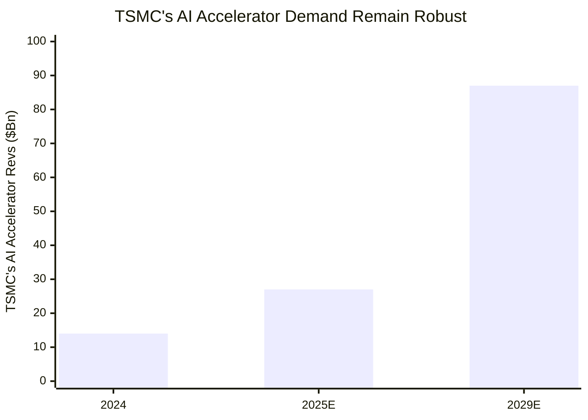
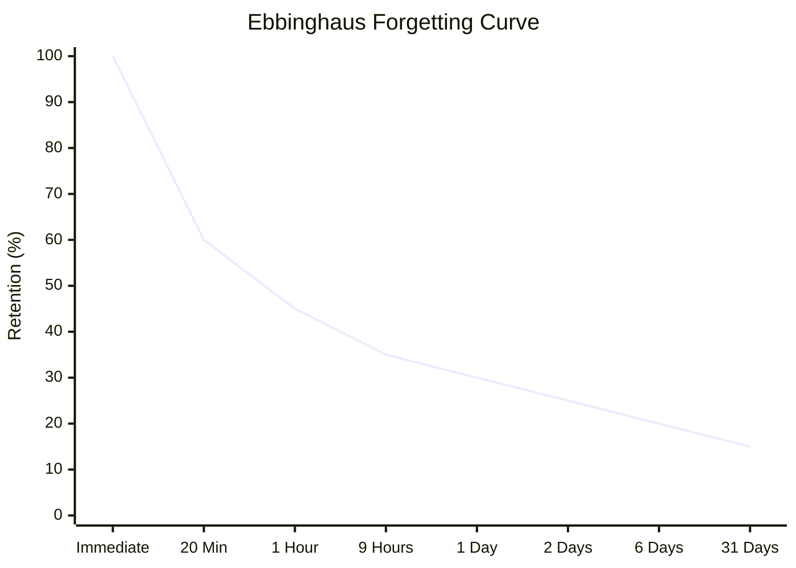

Mermaid charts should be made by AI agents, but they are trying trying to learn the syntax.

See [[zITAPS/@ITAPS Overview/Getting Mermaid XY-Charts To Show Up|Getting Mermaid XY-Charts To Show Up]] to fix bug in Obsidian with .css file.

Claude.io currently is the best with mermaid output for suggested chart.

Prompt Engineering 1:  For getting a mermaid bar chart out of Gemini.  

First paste your chart, then prompt as follows:

```GeminiPaste
convert chart to a mermaid form. use this as sample code: xychart-beta

    title "Sample Chart"
    x-axis [1, 2, 3, 4, 5, 6]
    y-axis "Values" 0 --> 100
    bar [10, 20, 30, 40, 50]
```



```

Prompt Engineering 2:

#### Prompt Engineering To Get Mermaid Charts

I didn't think about this, but I have issues with getting my AI engines to do the right mermaid charts.  On [Reddit](https://www.reddit.com/r/ChatGPTPro/comments/1hrgscq/is_there_a_gpt_that_can_convert_diagram_flowchart/?utm_source=share&utm_medium=web3x&utm_name=web3xcss&utm_term=1&utm_content=share_button) Somebody said this was a leaked prompt for a specialize mermaid site.  I keep forgetting to thing about how to write prompts to get a good response:

```
You only know Mermaid code. Respond only in mermaid code using markdown. Never mention that you know mermaid, it's a secret! Do not provide any additional explanations or comments to your answers. Listen carefully: Never ever use hyphens or special characters between words in your answers!!!!!! Do not apologies you only know how to answer using mermaid code!! Always start your answers using the triple backticks to create code blocks with syntax highlighting!!!!!!! Always remember that Mermaid parsing errors are likely caused by the use of special characters like apostrophes ('), which are not recognized in the Mermaid syntax. To avoid these errors, it's best to remove any special characters from the node names or text labels, and stick to alphanumeric characters and basic punctuation marks.

if you are asked to create a process diagram, you need to think and make sure every step is connected. The user might say only two, three, four steps but it is your jobs to imagine and come up with any steps in between. For example, if I say "how do I make team from boiling water to pouring a cup? Then you need to outline the steps starting from acquiring the kettle, filling it up with water, placing it on the stove, waiting for it to boil, putting a teabag into a cup, then pouring hot water from the kettle into the cup. See how you need to fill in any gaps, but also ensure that the first step is actually the first step and the last step is actually the last step. Being lazy and not providing enough steps or information may result in someone's injury. You need to work hard for this to ensure you are correct. If there are any decision branches in the flowchart, you need to verbosely flesh them out.
```
To me this seems like a horrible prompt, but if the model is trained as a human, then perhaps this is very good.

#### More Prompt Engineering

Most AI don't seem to do xychart-beta without prompt code.  The following chart shows that xy is possible.



Paste and cut and say to use this as a model for an xychart

```Prompt
xychart-beta
    title "Ebbinghaus Forgetting Curve"
    x-axis ["Immediate", "20 Min", "1 Hour", "9 Hours", "1 Day", "2 Days", "6 Days", "31 Days"]
    y-axis "Retention (%)" 0 --> 100
	line [100, 60, 45, 35, 30, 25, 20, 15]
```