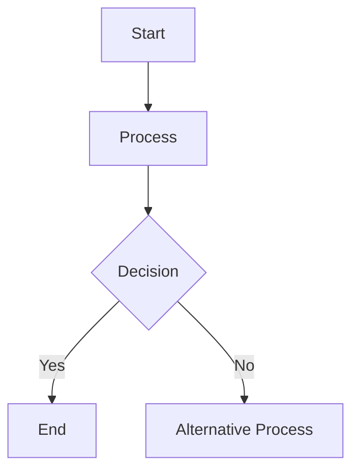

[See Here](https://wiki.freephile.org/wiki/Mermaid).

High suggest [[Getting Mermaid XY-Charts To Show Up]] to set your CSS file to fix issues with display for XYCharts.

Mermaid capability for the creation of charts should be encouraged between of the distillation of graphic information into clear text.

See [[Mermaid Syntax]] for more comments for useage.

Mermaid is a JavaScript-based diagramming and charting tool that uses a simple and intuitive text syntax to create dynamic diagrams and flowcharts. Here's a summary of what Mermaid charts are:

### What are Mermaid Charts?

**Mermaid** allows users to create a variety of diagrams using Markdown-like syntax. These diagrams include flowcharts, sequence diagrams, class diagrams, Gantt charts, and more. The simplicity of Mermaid's syntax makes it accessible to those who may not have advanced technical skills.

### Key Features

1. **Ease of Use**: Mermaid uses an easy-to-read and write syntax. This makes it simple to create complex diagrams with minimal effort.
2. **Dynamic Diagrams**: The diagrams can be rendered dynamically within web pages or documentation tools that support Mermaid.
3. **Markdown Integration**: Mermaid integrates seamlessly with Markdown, making it a popular choice for documentation platforms like GitHub, Obsidian, and more.
4. **Variety of Diagrams**: Mermaid supports multiple types of diagrams, including flowcharts, sequence diagrams, class diagrams, state diagrams, Gantt charts, and entity-relationship diagrams.

### Example Syntax

Here's a simple example of Mermaid syntax for a flowchart:

### Benefits

- **Visual Clarity**: Diagrams enhance the visual representation of information, making it easier to understand complex processes and relationships.
- **Documentation**: Mermaid is widely used in technical documentation to visualize workflows, system architectures, and more.
- **Collaboration**: The text-based format of Mermaid allows for easy collaboration and version control, as diagrams can be edited like code.

In essence, Mermaid charts provide a versatile and user-friendly way to create and integrate diagrams into documentation and web content. If you have any specific questions about using Mermaid, feel free to ask!