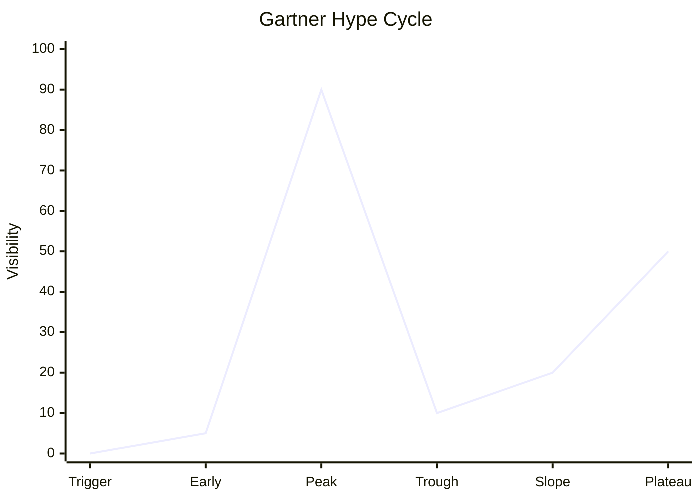

Supports [[AI is ready to Cross The Chasm And Out Of The Trough]]

#### Introduction To The Gartner Hype Cycle With Caution

The Gartner Hype Cycle, often referred to as the Gartner curve, is a graphical representation that illustrates the maturity, adoption, and social application of specific technologies. Developed by the research and advisory company Gartner, this tool helps organizations understand the lifecycle stages a technology goes through from its inception to mainstream adoption.

Why the hype cycle is an excellent model, Gartner has shown that they have struggled to have a high level of accuracy.  Most likely because they are weaker in understanding the core technology, which means they do not understand what is probable, possible and impossible.  However, they have an extremely successful business, and talk to a lot of key Fortune 500 companies.  

They have lots of material on youtube with is good to review.

[[Gartner June 2024 AI Curve]]

#### Curve Overview

#### Details

The Gartner Hype Cycle consists of five key phases:

1. Technology Trigger: This initial phase marks the emergence of a potential technological breakthrough. There's typically significant media interest, but often no usable products exist yet.

2. Peak of Inflated Expectations: In this phase, publicity generates overenthusiasm and unrealistic expectations. While some early success stories emerge, there are also numerous failures.

3. Trough of Disillusionment: Interest wanes as experiments and implementations fail to meet expectations. Many producers of the technology struggle or fail at this stage.

4. Slope of Enlightenment: More practical applications of the technology become evident. Second and third-generation products appear, and more businesses start funding pilots.

5. Plateau of Productivity: The technology's benefits become widely demonstrated and accepted. The technology becomes increasingly stable and evolves in second and third generations.

The Gartner Hype Cycle serves several purposes:

- It provides a snapshot of the relative market penetration and maturity of technologies within a specific segment.
- It helps organizations evaluate innovations based on their perceived value, business benefit, adoption rate, and future direction.
- It assists in strategic decision-making about when to invest in or adopt new technologies.

By understanding where a technology sits on the Hype Cycle, businesses can make more informed decisions about their technology investments, avoiding common pitfalls such as adopting too early, giving up too soon, adopting too late, or hanging on too long[1][3][4].

Citations:
[1] https://www.techtarget.com/whatis/definition/Gartner-hype-cycle
[2] https://www.youtube.com/watch?v=jB1RDz9jaj0
[3] https://community.virginpulse.com/hubfs/Understanding_Gartne_793868_ndx%20(1).pdf
[4] https://www.sangfor.com/blog/cybersecurity/what-is-gartner-hype-cycle-sangfor-named-in-6-gartner-hype-cycle-reports
[5] https://www.arteris.com/blog/the-gartner-hype-cycle-technology-adoption-lifecycle-explained-using-noc-technology/
[6] https://en.wikipedia.org/wiki/Gartner_hype_cycle
[7] https://money.usnews.com/investing/articles/gartner-hype-cycle
[8] https://www.linkedin.com/pulse/understanding-gartner-hype-cycle-abdulaziz-alakeel-cwtgc