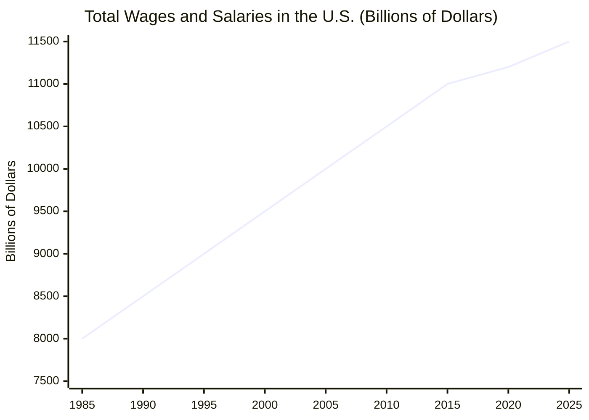

[See here](https://tradingeconomics.com/united-states/total-wages-and-salaries-bls-fed-data.html)

This is to support [[The USA Income Statement]]

Chart below.  Estimate 11.5B for 2024

```mermaid
xychart-beta
    title "Total Wages and Salaries in the U.S. (Billions of Dollars)"
    x-axis ["1985", "1990", "1995", "2000", "2005", "2010", "2015", "2020", "2025"]
    y-axis "Billions of Dollars" 7500 --> 11500
    line [8000, 8500, 9000, 9500, 10000, 10500, 11000, 11200, 11500]
```
