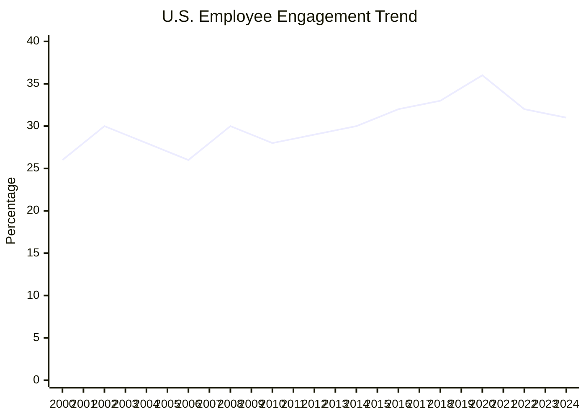
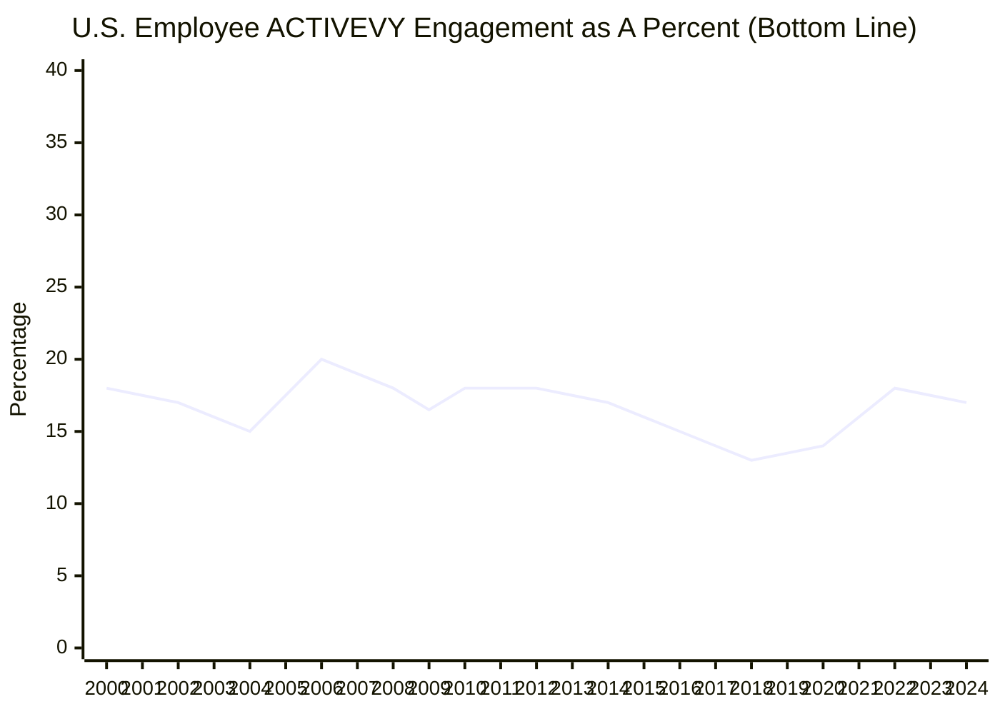

Employee engagement in the U.S. fell to its lowest level in a decade in 2024, with only 31% of employees engaged. This matches the figure last seen in 2014. The percentage of actively disengaged employees, at 17%, also reflects 2014 levels.

The percentage of engaged employees has declined by two percentage points since 2023, highlighting a growing trend of [employee detachment](https://www.gallup.com/workplace/653711/great-detachment-why-employees-feel-stuck.aspx) from organizations, particularly among workers younger than 35.

These are among the findings of Gallup’s most recent annual update of U.S. employee engagement. Though engagement increased slightly midyear, it declined through the rest of 2024, finishing the year at its decade low.

In Gallup’s trend dating back to 2000, employee engagement peaked in 2020, at 36%, following a decade of steady growth, but it has generally trended downward since then.

Each point change in engagement represents approximately 1.6 million full- or part-time employees in the U.S. The declines since 2020 equate to about 8 million fewer engaged employees, including 3.2 million fewer compared to 2023.

## **Declines in Employee Engagement: Key Trends**

Among the 12 engagement elements that Gallup measures, those that saw the most significant declines in 2024 (by three points or more in “*strongly agree”* ratings) include:

- **Clarity of expectations.** Just 46% of employees clearly know what is expected of them at work, down 10 points from a high of 56% in March 2020.
- **Feeling someone at work cares about them as a person.** Currently, 39% of employees feel strongly that someone cares about them, a drop from 47% in March 2020.
- **Someone encouraging their development.** Only 30% strongly agree that someone at work encourages their development, down from 36% in March 2020.

People of all ages come to work seeking role clarity, strong relationships and opportunities for development, but managers, combined, are progressively failing to meet these basic needs. However, managers themselves are faring no better than those they manage, with only 31% engaged.

## **Workforce Segments Most Affected**

The drop in employee engagement in 2024 was most pronounced for these U.S. workforce segments:

- **Workers younger than 35.** In particular, Gen Z employees were five points less engaged than the year prior, with notable declines on the most fundamental engagement elements: clarity of expectations, receiving recognition, being provided with materials and equipment to do their work well, having opportunities to do what they do best, feeling cared about, and having opportunities to develop.
- **Employees in specific industries.** Engagement fell in the finance and insurance, transportation, technology, and professional services sectors.

## **The Broader Economic Context**

This decline in employee engagement occurred in a challenging economic environment. Job vacancies continued to surpass hiring rates, but fewer people in 2024 said it was a good time to find a job. Quit rates are trending slightly down from 2021-2022 peaks, as reported by the Bureau of Labor Statistics (BLS), but remain near their longer-term averages.

The BLS has also reported improvements in overall non-farm labor productivity relative to the previous year, but growth in business labor productivity was lower than the previous year’s. 

While higher employee engagement leads to more productive business units, how is labor productivity increasing even as employee engagement declines? Leaders working to strengthen their employee engagement strategy should consider three points:

- The quality of work is only one aspect of productivity and is especially difficult for the BLS to measure. The BLS typically measures productivity as the ratio of revenue to hours worked (labor productivity), which is not a measure of work quality. Output per worker can result from technological advances, the rising value of intellectual property or capital investments.
- Employee engagement -- the involvement and enthusiasm employees feel toward their work and workplace -- [predicts numerous outcomes](https://www.gallup.com/workplace/649487/world-largest-ongoing-study-employee-experience.aspx) across business units within companies, including quality of work, safety, profitability and more.
- Recent findings from The Conference Board suggest CEOs had lower confidence in their own industries in late 2024.

Employee engagement trends matter for organizational leaders because declines signal potential vulnerabilities for businesses. Broad macroeconomic indexes do not always reflect what leaders and employees are experiencing in their own workforces and industries.

The factors that affect macro conditions do not necessarily align with the micro conditions --such as the quality of managing -- that directly affect how employees feel at work every day, their individual productivity and their wellbeing. Moreover, macroeconomic conditions, such as unemployment rates, inflation and interest rates, can limit the success of individual organizations that have little to do with the engagement of their workforce. For instance, when mortgage rates are high, even the most engaged and skilled real estate agents struggle to close deals compared with periods with lower rates.

Gallup research attributes [declining employee engagement and rising detachment](https://www.gallup.com/workplace/653711/great-detachment-why-employees-feel-stuck.aspx) to:

- rapid organizational change
- challenges from hybrid and remote work transitions
- new customer and employee expectations
- broken performance management practices

## **What Can Leaders Do: How to Improve Employee Engagement**

Despite declining overall U.S. engagement, many organizations Gallup has studied have achieved and maintained engagement [levels more than twice the national average](https://www.gallup.com/workplace/329768/gallup-exceptional-workplace-awards.aspx). Despite the significant challenges workplaces have faced since 2020, strong leaders and managers can reverse engagement declines by focusing on these strategies:

- Define what they want in their workplace culture and how that aligns with the organization’s purpose and value to customers.
- Lead with their own strengths while clarifying the organization’s purpose, approach to people, key decisions and performance. Specifically, include a plan for upskilling managers to build stronger bonds between employees and the organization through clear priorities, ongoing feedback, and accountability.
- Prioritize identifying and selecting managers with the innate ability to engage and inspire employees, especially in a workplace environment where employees feel detached.

## Author(s)

Jim Harter, Ph.D., is Chief Scientist, Workplace for Gallup and bestselling author of [*Culture Shock*](https://www.gallup.com/workplace/469790/culture-shock.aspx), [*Wellbeing at Work*](https://www.gallup.com/workplace/336935/wellbeing-at-work.aspx), [*It's the Manager*](https://www.gallup.com/itsthemanager/home.aspx), [*12: The Elements of Great Managing*](https://www.gallup.com/press/176450/elements-great-managing.aspx) and [*Wellbeing: The Five Essential Elements*](https://www.wbfinder.com/home.aspx "Wellbeing: The Five Essential Elements"). His research is also featured in the groundbreaking *New York Times* bestseller, [*First, Break All the Rules*](https://www.gallup.com/press/176069/first-break-rules-world-greatest-managers-differently.aspx). Dr. Harter has led more than 1,000 studies of workplace effectiveness, including the largest ongoing meta-analysis of human potential and business-unit performance. His work has also appeared in many publications, including *Harvard Business Review*, *The New York Times* and *The Wall Street Journal*, and in many prominent academic journals.

*Sangeeta Agrawal and Jonathan Rothwell provided analysis and input for this article.*