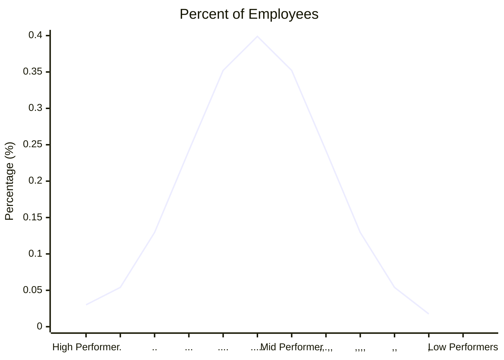

While embraced by corporation, the research does not support this device popularized by Jack Welsh.

See [[Bell Curve Inadequate For Human Performance]] for a non-academic overview.

#### Quote from researcher on the Vitality Curve

**" "How organizations hire, maintain and assess their workforces has been built on the idea of normality in performance, which we now know is, in many cases, a complete myth," Aguinis says."

#### History And Popularization Of Bell Curve

The chart below represents Jack Welsh's view of the employee base is a standard distribution of performance

He said that there were 20% at the top that we truly great employees and GE had more higher performers than low.
There was 70% in the middle that were vital
But the bottom 10% could go

Welsh's frame work for leadership was

1. **4E**: The four essential leadership traits Welch emphasized:
   - **Energy**: The ability to go, go, go, with an innate energy that powers their actions.
   - **Energize**: The ability to energize others, bringing enthusiasm and motivating the team.
   - **Edge**: The ability to make tough decisions, having the edge to stand firm.
   - **Execute**: The ability to get things done, delivering results consistently.

2. **1P**: Passion:
   - **Passion**: The deep and authentic commitment to work and the drive to strive for excellence. Passionate leaders are often highly engaged, enthusiastic, and inspire those around them.

These principles were widely implemented at General Electric during Welch's tenure and are still considered effective criteria for evaluating leadership qualities in various business contexts.
